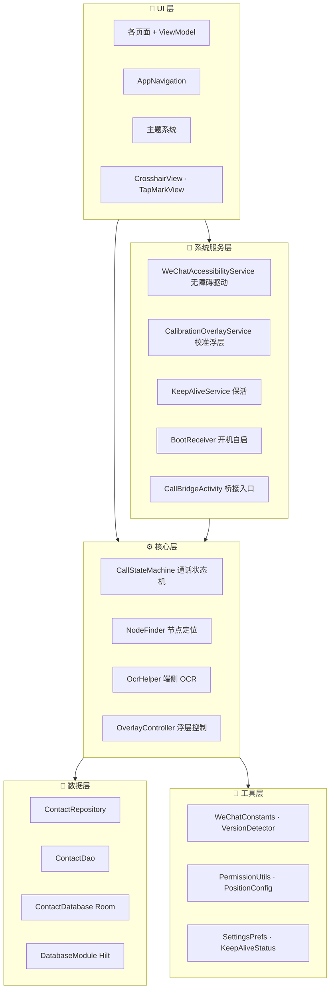

<div align="center">

# 📞 微信视频 · ElderWeChatVideo

**让老人「一键」发起微信视频通话的 Android 辅助应用**

[](https://android.com)
[](https://kotlinlang.org)
[](https://developer.android.com/jetpack/compose)
[](https://dagger.dev/hilt)
[-blue)]()
[]()


[功能特性](#-功能特性) · [技术架构](#️-技术架构) · [快速开始](#-快速开始) · [版本记录](#-版本记录) · [隐私说明](#-隐私说明)

</div>

---

## ✨ 功能特性

### 📞 一键视频通话
通过系统无障碍服务自动识别微信界面，找到指定联系人并发起视频通话。**三层拨号防线**确保成功率：
- **节点查找** — 无障碍树直接定位微信按钮
- **OCR 识别** — ML Kit 端侧中文文字识别，节点查找失败时自动降级
- **坐标校准** — 悬浮层手动校准，适配不同机型分辨率

### 👵 专为老人优化
- **大字体、大按钮、高对比** — Jetpack Compose Material3 定制主题
- **联系人本地管理** — Room 数据库存储，增删改查，数据不上云
- **状态反馈清晰** — 每一步操作都有明确的状态提示

### 🔒 隐私优先
- **端侧 OCR** — ML Kit 文字识别完全在本地运行，无需联网
- **本地联系人** — 仅存于本机 Room 数据库，不上传任何服务器
- **无障碍服务透明** — 需在系统设置中手动开启，不会后台静默启动

### 🔋 可靠保活
- **前台服务** — 持续保活，老人随时能一键通话
- **开机自启** — 设备重启后自动恢复服务
- **健康监控** — 每 5 分钟检查无障碍服务连接状态，断开主动通知

---

## 🖥️ 技术架构

<div align="center">



</div>

### 数据流

> **用户选择联系人** → CallBridgeActivity 拉起通话 → WeChatAccessibilityService 接管微信界面 → NodeFinder / OcrHelper 定位「视频通话」按钮 → CallStateMachine 推进通话状态 → OverlayController 显示校准/状态浮层

---

## 🛠️ 技术栈

| 类别 | 选型 | 版本 |
|------|------|------|
| 语言 | Kotlin | 2.0.20 |
| UI | Jetpack Compose (Material3) | BOM 2024.09.02 |
| 导航 | Navigation Compose | 2.8.0 |
| 依赖注入 | Hilt | 2.52 |
| 本地存储 | Room | 2.6.1 |
| 图片加载 | Coil | 2.7.0 |
| 端侧 OCR | ML Kit text-recognition-chinese | 16.0.1 |
| 构建 | Android Gradle Plugin / KSP | 8.5.2 / 2.0.20-1.0.25 |

---

## 🚀 快速开始

### 前置条件
- JDK 17
- Android SDK（compileSdk = 35）
- Android 8.0+（API 26）真机（调试无障碍能力必需）

### 构建步骤

```bash
# 1. 克隆仓库
git clone https://github.com/Alex-Maxzz/WeChat-Video.git
cd WeChat-Video

# 2. 配置本地 SDK 路径
echo "sdk.dir=C:\Users\你的用户名\AppData\Local\Android\Sdk" > local.properties

# 3. Android Studio 打开项目，等待 Gradle 同步

# 4. 连接真机 → 运行 app 模块
```

### ⚠️ Gradle Wrapper 说明
`gradle-wrapper.jar` 为二进制文件，未纳入版本库。克隆后请执行：
```bash
gradle wrapper
```
或使用本机已安装的 Gradle 构建。

---

## 🔐 权限与隐私

本应用为辅助老人使用微信而设计，需要以下敏感能力：

| 权限 | 用途 | 是否可关闭 |
|------|------|:----------:|
| **无障碍服务** | 识别并操作微信界面以发起通话 | 需在系统设置手动开启 |
| **前台服务** | 保活，确保老人随时能一键通话 | 可关闭（会降低可靠性） |
| **开机自启** | 设备重启后自动恢复服务 | 可在设置中关闭 |
| **悬浮窗** | 显示校准层和状态浮层 | 可关闭 |

> **核心通话流程不依赖网络上传**；OCR 由 ML Kit 在端侧完成。
> 
> 请仅在本人设备/授权设备上使用，并遵守微信相关使用规范。

---

## 🧪 测试

单元测试位于 `app/src/test/java/...`，使用 JUnit4（纯 JVM，无需 Robolectric）：

- `core/OcrHelperTest.kt`
- `util/KeepAliveStatusTest.kt`
- `util/PositionConfigTest.kt`

```bash
./gradlew :app:testDebugUnitTest
```

---

## 📝 版本更新记录

### V1.7.6_Alis（2026-08-06）`当前版本`

- 🔧 **进入聊天页后误判中止（P0）**：`runLandingVerification` 落点校验时 `isNonChatPage` 在 `hasChatSessionIndicator` 之前检查，聊天页无障碍树中碰巧包含负面关键词导致假阳性。修复：调换检查顺序，先确认聊天页特征再查负面关键词

### V1.7.5_Alis（2026-08-06）

- 🔧 **搜索结果误点网络搜索/公众号（P0）**：微信搜索页"最常使用"和"搜索网络结果"分段标题不在识别列表里，导致分段过滤失效。修复：`CONTACT_SECTION_HEADERS` 加"最常使用"，`NON_CONTACT_SECTION_HEADERS` 加"搜索网络结果"；同时修复 `findContactsSectionBounds` 用 `in` 精确匹配导致"联系人 3"等带数字标题匹配不上的 bug

### V1.7.4_Alis（2026-08-06）

- 🔧 **视频通话菜单验证假阳性（P0）**：`tryClickVideoConfirm` 验证菜单是否弹出时，`findVideoCallButton` 和 `VIDEO_CALL_TEXTS` 会在 +面板还开着时匹配到"视频通话"文本导致假成功。修复：只检查"语音通话"文本（仅出现在选择菜单，+面板没有），未弹出则 fail 报错

### V1.7.3_Alis（2026-08-06）

- 🔧 **clickNode performAction 返回 false 时不兜底坐标点击（P0）**：微信 + 面板视频通话节点不可点击时 `performAction` 失败，之前只打 warning 就跳过，导致流程空转。修复：`performAction` 失败时用节点屏幕坐标 `gestureClickAt` 兜底点击

### V1.7.2_Alis（2026-08-06）

- 🔧 **校准页面重启后误报无障碍未开启**：`CalibrationScreen` 改用 `isConnected || isAccessibilityServiceEnabled` 双重判断
- 🔧 **视频通话坐标点击偏移到转账（P0）**：`tryClickVideoCall` 改为节点优先查找，节点找不到才用坐标兜底
- 🔧 **auto_dial=false 时不验证视频菜单是否弹出就误判成功**：`tryClickVideoConfirm` 增加落地验证，菜单未弹出则报错提示重新校准

### V1.7.1_Alis（2026-08-06）

- 🔧 **gradle.properties 机器特定路径迁移修复**：`org.gradle.java.home` 和 `aapt2FromMavenOverride` 移至用户级 `~/.gradle/gradle.properties`，命令行构建不再找不到 JDK
- 🔧 **fail() 后 3 秒内重新拨号浮层被提前隐藏**：`beginCallFlow()` 开头清除旧 `overlay.hide()` 回调
- 🔧 修正 `SettingsPrefs.kt` 类注释：移除已删除的"浮窗位置锁定"描述

### V1.7.0_Alis（2026-08-06）

- 🔧 **fail() 竞态导致取消/失败后仍可能误点击（P0）**：`sm.resetToIdle()` 延迟 3 秒，期间 OCR/盲戳检查 `sm.isActive` 仍为 true 会误点击。改为立即切 IDLE
- 🔧 **resetSearchForRetry 漏重置 searchClickRetries**：搜索结果超时重试时计数不清零，累计触发"搜索按钮无法打开"误报
- 🧹 清理死代码：删除未调用的 AutoDialCard、失效的浮窗位置固定开关、8 个零引用僵尸常量

### V1.6.9_Alis（2026-08-03）
- 🔧 重启后快捷方式误报「无障碍未开启」— 增加 isConnected 运行时标志

### V1.6.8_Alis
- 🔧 聊天页判断假阴性修复
- 🔧 OCR 分段标题匹配改为精确匹配

### V1.6.7_Alis
- 🔧 落点校验适配微信新版图标界面
- 🔧 失败后无法重试修复
- 🔧 新增 bjz 资源 ID 支持

[查看完整版本记录](docs/版本更新文档.html)

---


</div>
