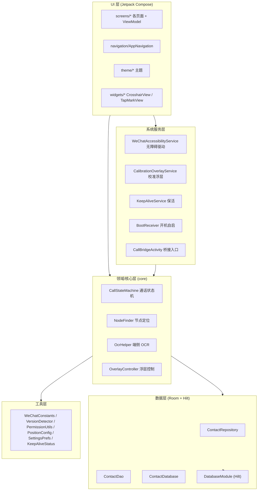

# 微信视频 · ElderWeChatVideo

> 面向老年人的**微信视频通话辅助** Android 应用。通过系统无障碍服务（AccessibilityService）识别并驱动微信界面，配合悬浮校准层，让老人"一键"发起微信视频通话；联系人本地存储，通话流程由状态机驱动。

- **包名**：`com.elder.wechatvideo`
- **版本**：`1.6.3_Alis`（versionCode 28）
- **最低/目标 SDK**：`minSdk 26` / `compileSdk & targetSdk 35`
- **技术栈**：Kotlin 2.0.20 · Jetpack Compose · Hilt · Room · Navigation Compose · ML Kit 中文 OCR

---

## 功能特性

- 📞 **一键视频通话**：自动在微信中找到指定联系人并发起视频通话
- 👵 **大字大点**：专为老人优化的 Compose 界面（大字体、大按钮、高对比）
- 📇 **本地联系人管理**：增删改查，数据存于本地 Room 数据库（不上云）
- 🎯 **按键位置校准**：首次使用引导校准悬浮层与微信界面坐标偏移
- 🔋 **保活与自启**：前台保活服务 + 开机自启广播，确保随时可用
- 🔍 **端侧 OCR 兜底**：ML Kit 中文文字识别，作为节点定位失败时的兜底方案

---

## 系统架构

采用**分层架构**，UI 与业务逻辑解耦，核心通话能力下沉到 `core` 与 `service` 层，数据通过 Room + Hilt 注入。



**数据流简述**：用户在 UI 选择联系人 → `CallBridgeActivity` 拉起通话 → `WeChatAccessibilityService` 接管微信界面 → `NodeFinder`/`OcrHelper` 定位"视频通话"按钮 → `CallStateMachine` 推进通话状态 → `OverlayController` 显示校准/状态浮层。

---

## 模块 / 包结构

| 包路径 | 职责 |
|--------|------|
| `com.elder.wechatvideo` | 应用入口 `ElderWeChatApp`（继承 `HiltAndroidApplication`） |
| `.bridge` | `CallBridgeActivity`：拉起通话的桥接/入口 Activity |
| `.core` | 通话核心：`CallStateMachine`（状态机）、`NodeFinder`（节点查找）、`OcrHelper`（OCR）、`OverlayController`（浮层控制） |
| `.data` | 联系人持久化：`ContactEntity` / `ContactDao` / `ContactDatabase` / `ContactRepository` |
| `.data.di` | `DatabaseModule`：Hilt 提供 Room 依赖 |
| `.keepalive` | 保活：`AutostartPrefs` / `BootReceiver` / `KeepAliveService` |
| `.service` | `WeChatAccessibilityService`（核心无障碍驱动）、`CalibrationOverlayService`（校准浮层） |
| `.shortcut` | `ShortcutHelper` / `ShortcutResultReceiver`：桌面快捷方式 |
| `.ui` | Compose UI：`navigation`、`screens`（各页面 + ViewModel）、`theme`、`components`、`widgets` |
| `.util` | 常量与工具：`WeChatConstants`、`WeChatVersionDetector`、`PermissionUtils`、`PositionConfig`、`SettingsPrefs`、`KeepAliveStatus` |
| `.widget` | 自定义 View：`CrosshairView`、`TapMarkView` |

**目录树（核心源码）**：

```
app/src/main/
├── AndroidManifest.xml
├── java/com/elder/wechatvideo/
│   ├── ElderWeChatApp.kt
│   ├── MainActivity.kt
│   ├── bridge/CallBridgeActivity.kt
│   ├── core/{CallStateMachine,NodeFinder,OcrHelper,OverlayController}.kt
│   ├── data/{ContactEntity,ContactDao,ContactDatabase,ContactRepository}.kt
│   ├── data/di/DatabaseModule.kt
│   ├── keepalive/{AutostartPrefs,BootReceiver,KeepAliveService}.kt
│   ├── service/{WeChatAccessibilityService,CalibrationOverlayService}.kt
│   ├── shortcut/{ShortcutHelper,ShortcutResultReceiver}.kt
│   ├── ui/components/{AvatarChar,AvatarView}.kt
│   ├── ui/navigation/AppNavigation.kt
│   ├── ui/screens/{about,calibration,contacts,keepalive,settings}/...
│   ├── ui/theme/{Color,Theme,Type}.kt
│   ├── util/{KeepAliveStatus,PermissionUtils,PositionConfig,SettingsPrefs,WeChatConstants,WeChatVersionDetector}.kt
│   └── widget/{CrosshairView,TapMarkView}.kt
├── res/  (drawable / mipmap / values / xml)
└── test/...  (单元测试)
```

---

## 技术栈

| 类别 | 选型 | 版本 |
|------|------|------|
| 语言 | Kotlin | 2.0.20 |
| UI | Jetpack Compose (Material3) | BOM 2024.09.02 / M3 1.3.0 |
| 导航 | Navigation Compose | 2.8.0 |
| 依赖注入 | Hilt | 2.52 |
| 本地存储 | Room | 2.6.1 |
| 图片加载 | Coil | 2.7.0 |
| 端侧 OCR | ML Kit text-recognition-chinese | 16.0.1 |
| 构建 | Android Gradle Plugin / KSP | 8.5.2 / 2.0.20-1.0.25 |
| 测试 | JUnit4（纯 JVM 单测） | 4.13.2 |

---

## 构建与运行

**前置条件**

- JDK 17
- Android SDK（项目 `compileSdk = 35`，构建工具见 `gradle.properties` 中 `android.aapt2FromMavenOverride` 指向本地 build-tools 34.0.0）
- Android 8.0+（API 26）真机用于调试无障碍能力

**步骤**

1. 克隆仓库
2. 在根目录创建 `local.properties` 并写入本机 SDK 路径：
   ```properties
   sdk.dir=/path/to/Android/Sdk
   ```
   （该文件已被 `.gitignore` 忽略，不会入库）
3. 打开 Android Studio，等待 Gradle 同步
4. 连接真机（API 26+），运行 `app` 模块

> ⚠️ **关于 Gradle Wrapper**：`gradle-wrapper.jar` 为二进制文件，未纳入版本库。克隆后请在本机执行 `gradle wrapper`（或复制本机已有 wrapper jar 到 `gradle/wrapper/`）以使用 `./gradlew`；也可直接用系统已安装的 Gradle 构建。

---

## 权限与隐私说明

本应用为辅助老人使用微信而设计，**需要以下敏感能力，请知悉**：

- **无障碍服务（AccessibilityService）**：用于识别并操作微信界面以发起通话。需在系统设置中手动开启，应用不会在后台静默开启。开启后该服务可"观察/操作"屏幕上其他应用（微信）的界面。
- **保活与前台服务**：`KeepAliveService` 以前台服务形式保活，`BootReceiver` 在开机后自启，目的是让老人随时能一键通话。
- **本地优先**：联系人数据仅存于本机 Room 数据库，**核心通话流程不依赖网络上传**；OCR 由 ML Kit 在端侧完成。

请仅在本人设备/授权设备上使用，并遵守微信相关使用规范。

---

## 测试

单元测试位于 `app/src/test/java/...`，使用 JUnit4（纯 JVM，无需 Robolectric）：

- `core/OcrHelperTest.kt`
- `util/KeepAliveStatusTest.kt`
- `util/PositionConfigTest.kt`

运行：`./gradlew :app:testDebugUnitTest`

---

## 设计文档

UI 与架构设计预览归档于 [`docs/design/`](docs/design/)：

- `架构示意.html` · `界面预览_架构对齐.html` · `设计系统预览v2.html` · `图标优化v2.html`
- `calibration/`：校准悬浮窗设计规范与预览

---

## 许可证

未指定许可证。如需开源，请补充 `LICENSE` 文件。
